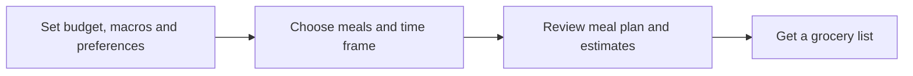

# FiFi

**Meal planning for your macros and your budget.**

FiFi is a project for people who train and want to eat in line with their nutrition goals without planning every meal and grocery trip from scratch. Users choose a planning window, set their own macro targets and food budget, and receive a practical meal plan with a consolidated shopping list.

> **Status:** Idea and data feasibility stage. The features below describe the intended prototype, not an app that is already live.

## The problem

Hitting a protein or macro target takes more than picking a healthy recipe. Users also have to work out portions, cooking time, ingredient quantities, and whether the groceries they actually need to buy fit their budget. Planning several meals at once makes those decisions harder.

## How FiFi will work

The intended flow lets a user:

1. Choose **one meal, one day, two to three days, or one week**.
2. Enter a food budget, self-set macro goals, foods to avoid, and available cooking time.
3. See suggested meals, portions, and estimated calories, protein, carbs, fat, and cost.
4. Swap a meal and update the plan and grocery list.
5. Shop from one list that combines ingredients across meals and accounts for product pack sizes.

For example, someone could plan lunch and dinner for three training days under a chosen budget. FiFi would show the proposed meals and the groceries needed for all six meals, including shared ingredients.

Workout schedules, health tracking, direct checkout, and clinical nutrition advice are outside the initial scope.
